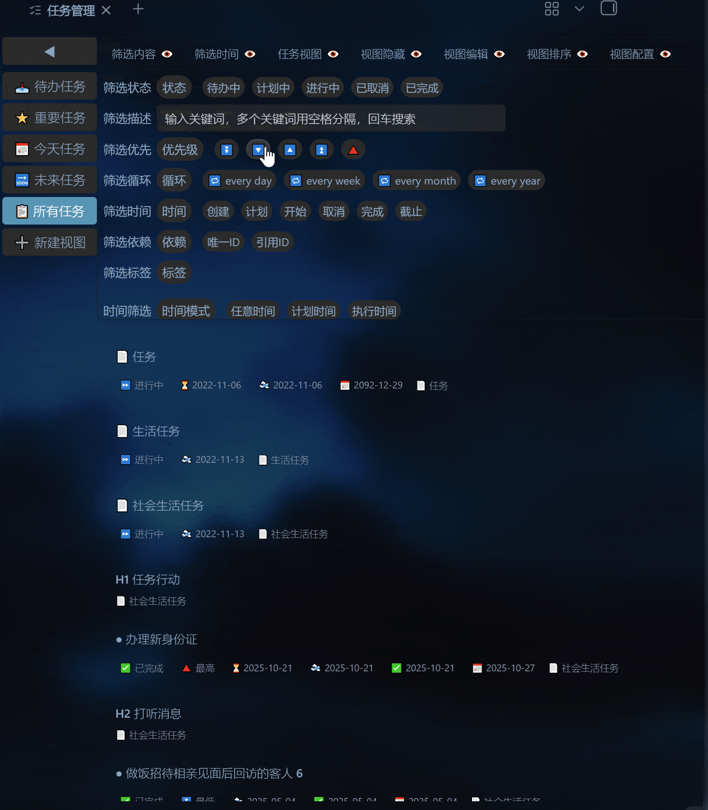

# 任务管理 (Task Manage)

<p align="center">
  <a href="README.md">English</a> · <a href="README.zh.md">简体中文</a>
</p>

[](https://github.com/heart-freely/obsidian-task-manage/releases)
[](https://obsidian.md/plugins?id=obsidian-task-manage)

三级任务管理（文件/标题/列表），19种视图（看板/矩阵/日历/甘特图/任务树/统计），批量编辑任务标记，支持多种任务管理方式。



## 为什么选择任务管理插件

- **19 种视图**：从简单列表到高级甘特图，满足不同场景需求
- **全局筛选**：一次配置，所有视图同步生效
- **方案驱动**：保存多套视图配置，一键切换工作场景
- **批量编辑**：支持批量修改任务标记，快照撤回保安全
- **日历与甘特图**：时间维度可视化，直观掌握任务分布与依赖关系

## 依赖

本插件需要以下插件提供数据支持：

- [Tasks](https://obsidian.md/plugins?id=obsidian-tasks-plugin) — 任务标记解析与编辑

> 请先在 Obsidian 中安装并启用此插件。

## 安装

### 社区插件市场（推荐）

1. 打开 Obsidian **设置 → 社区插件**
2. 点击 **浏览**，搜索 **任务管理**
3. 安装并启用

### 手动安装

1. 从 [Releases](https://github.com/heart-freely/obsidian-task-manage/releases) 下载 `main.js`、`manifest.json`、`styles.css`
2. 放入 `<vault>/.obsidian/plugins/obsidian-task-manage/`
3. 重启 Obsidian 并启用插件

## 快速上手

### 1. 配置任务路径

安装后打开 **设置 → 任务管理**，在"任务路径"中添加包含任务的文件夹。插件会自动扫描其中的 Markdown 文件。

### 2. 打开主面板

点击左侧功能区的  图标，或使用命令面板搜索"任务管理"。

### 3. 选择视图

左侧边栏提供预设视图：

| 视图     | 说明                           | 适用场景           |
| -------- | ------------------------------ | ------------------ |
| 待办任务 | 待办中 + 计划中的任务          | 日常查看待办事项   |
| 重要任务 | 高优先级（🔺⏫🔼）的进行中任务 | 聚焦高优任务       |
| 今天任务 | 截止日期为今天的任务           | 处理当日到期任务   |
| 未来任务 | 未来 15 天内的任务             | 提前规划近期工作   |
| 所有任务 | 全部任务，无筛选               | 全局浏览或批量操作 |

点击 **➕ 新建视图** 可创建自定义方案。

### 4. 筛选与排序

顶部视图配置面板提供 7 个功能栏：

| 面板     | 功能                                                                 |
| -------- | -------------------------------------------------------------------- |
| 筛选内容 | 状态（待办/计划/进行中/已完成/已取消）+ 关键词搜索（空格分隔"且"逻辑）+ 标记（优先级/循环周期/日期/唯一ID/引用ID/标签） |
| 筛选时间 | 动态滑动条（日/周/月/季/年）+ 静态滑动条，支持"使用动态"联动         |
| 任务视图 | 4 组 19 种视图样式（基础/标记/管理/统计）                            |
| 视图隐藏 | 隐藏循环/已完成/已取消/指定状态/优先级/描述/标记任务                 |
| 视图排序 | 原始顺序 + 14 种排序字段，支持升降序                                 |
| 视图编辑 | 批量编辑/补全时间/标记排序/保存修改/快照撤回                         |
| 视图配置 | 视图名称与图标/导入导出 JSON/恢复默认/删除视图                       |

所有筛选条件自动保存，重启后恢复。

## 视图介绍

### 基础视图（列表 / 卡片 / 表格）

- **列表**：详细模式显示完整标记信息，简洁模式仅显示描述
- **卡片**：网格布局，左侧颜色条标识状态
- **表格**：可排序表格，空列自动隐藏

### 标记视图（状态 / 优先级 / 循环 / 日期 / 标签 / 唯一ID / 引用ID）

按选择的标记类型（如"优先级"）对任务进行分组，每组以独立颜色条标识。例如，选择"优先级"视图后，所有任务会按 🔺/⏫/🔼/🔽/⏬ 分为 5 组展示。

### 管理视图

#### 看板

待办中 / 计划中 / 进行中 三列横向排列。

#### 矩阵

四象限分类：🔺紧急重要 / ⏫不紧急重要 / 🔼紧急不重要 / 🔽⏬不紧急不重要。

#### 逾期

按逾期天数分组（今天到期 / 逾期 1 天 / 逾期 N 天）。

#### 时间轴

按截止日期分组，时间线展示任务分布。

#### 日历图

年 / 季 / 月 / 周 / 日五种视图：

- **年视图**：热力图，颜色深浅表示任务密度
- **季视图**：7 列，任务线条
- **月视图**：7 列，任务线条
- **周视图**：7 列，任务线条
- **日视图**：卡片列表

交互：点击日期头跳转日视图，双击任务条跳转源文件，鼠标悬停显示完整信息。

#### 甘特图

- 左侧任务树 + 右侧时间轴
- 任务条按执行状态着色
- 依赖箭头（⛔ 标记）自动绘制
- 按住 `Alt` 并滚动鼠标滚轮可缩放时间轴，拖拽空白区域可平移视图
- 点击 ➤ 按钮自动定位到任务条
- 单击任务条可跳转至左侧任务树对应节点

#### 任务树

按文件 → 标题 → 列表任务三级展示：

- 折叠/展开节点
- 进度条显示子任务完成情况
- 支持任务间父子关系（YAML `父任务` + Wiki 链接）

### 统计视图

- **标记统计**：6 个饼图，统计状态/优先级/循环/日期/依赖/标签
- **详细统计**：堆叠柱状图，按日期展示各状态任务数量变化
- **时间统计**：开发中

## 任务标记格式

插件解析任务行中的 Emoji 标记：

```text
- [ ] 任务描述 🔺 🔁 every week ➕ 2025-09-06 ⏳ 2025-09-06 🛫 2025-09-06 📅 2026-04-06 🆔 dcf64c ⛔ dcf64c 🏁 keep
```

| 标记            | 含义       | 示例                     |
| --------------- | ---------- | ------------------------ |
| `- [ ]`         | 待办中     | 执行状态（空格/?/>/x/-） |
| `🔺⏫🔼🔽⏬`    | 优先级     | 🔺（最高）→ ⏬（最低）   |
| `🔁 every ...`  | 循环周期   | 🔁 every week            |
| `➕ YYYY-MM-DD` | 创建日期   | ➕ 2025-09-06            |
| `⏳ YYYY-MM-DD` | 计划日期   | ⏳ 2025-09-06            |
| `🛫 YYYY-MM-DD` | 开始日期   | 🛫 2025-09-06            |
| `❌ YYYY-MM-DD` | 取消日期   | ❌ 2023-04-18            |
| `✅ YYYY-MM-DD` | 完成日期   | ✅ 2023-04-17            |
| `📅 YYYY-MM-DD` | 截止日期   | 📅 2026-04-06            |
| `🆔 id`         | 唯一标识   | 🆔 dcf64c                |
| `⛔ id1,id2`    | 依赖任务   | ⛔ dcf64c,h17ye          |
| `🏁 keyword`    | 自定义标签 | 🏁 keep                  |

> 标记顺序不敏感，插件会自动按规范排序。

## 编辑功能

在列表/卡片视图下，**单击任务卡片**进入编辑模式：

### 单个编辑

- 点击标记按钮（状态/优先级/循环/日期/标签/ID 等）修改对应标记
- 描述可直接点击编辑
- 预览实时显示修改结果
- 点击"保存"写入文件

### 批量编辑

1. 点击面板中"批量编辑"按钮
2. 勾选需要编辑的任务（支持全选/全不选）
3. 点击编辑按钮同步修改所有勾选任务
4. 支持补全时间、标记排序
5. 保存后可在"批量撤回"中恢复

## 文件间任务关系

插件支持通过以下方式建立任务文件间的父子关系：

- **YAML 元属性**：在子任务文件 frontmatter 中设置 `父任务: 父文件名`
- **Wiki 链接**：在父文件中使用 `[[子文件名]]`

两种方式并存时优先使用 YAML 声明。

### 插件设置

**设置 → 任务管理** 提供：

| 设置项    | 说明                                     |
| --------- | ---------------------------------------- |
| 任务路径  | 任务文件所在文件夹（支持多个，逗号分隔） |
| 匹配任务  | 文件夹/文件/标题/任务项四级过滤器        |
| 导入/导出 | 插件配置的 JSON 导入导出                 |

## 常见问题

**Q: 为什么打开面板后没有任务显示？**
A: 请检查以下几项：

1. 在 **设置 → 任务管理** 中正确配置了任务文件所在文件夹路径
2. 任务文件中包含有效的任务标记（至少需要 `- [ ]` 开头）
3. 已安装并启用 [Tasks](https://obsidian.md/plugins?id=obsidian-tasks-plugin) 插件

**Q: 甘特图为什么只有少量任务？**
A: 甘特图需要任务包含日期标记才能显示时间条。请确保任务至少包含以下之一：计划日期 `⏳`、开始日期 `🛫`、截止日期 `📅`。

**Q: 依赖箭头为什么不显示？**
A: 依赖箭头需要两个条件：

1. 被依赖的任务有 `🆔` 唯一标识
2. 依赖方任务有 `⛔` 引用该标识
3. 两个任务都有日期范围且在当前筛选结果中可见

**Q: 如何备份和恢复视图配置？**
A: 在视图配置面板中点击 **📤 导出配置** 保存为 JSON 文件，需要时点击 **📥 导入配置** 恢复。插件配置可在设置中导入导出。

**Q: 插件会修改我的原始任务文件吗？**
A: 会的。所有编辑操作（单编辑/批量编辑）都会直接修改 Markdown 文件。建议在批量操作前先备份或使用 Git 提交，插件自带的"快照撤回"功能可撤销最近一次批量编辑。

**Q: 插件支持移动端吗？**
A: 当前版本仅在桌面端测试通过，移动端兼容性将在后续版本中完善。

## 反馈与贡献

- 遇到问题？请在 [GitHub Issues](https://github.com/heart-freely/obsidian-task-manage/issues) 提交
- 欢迎提交 Pull Request 贡献代码
- 喜欢这个插件？给个 ⭐ 鼓励一下！

## 许可

[MIT](LICENSE)
